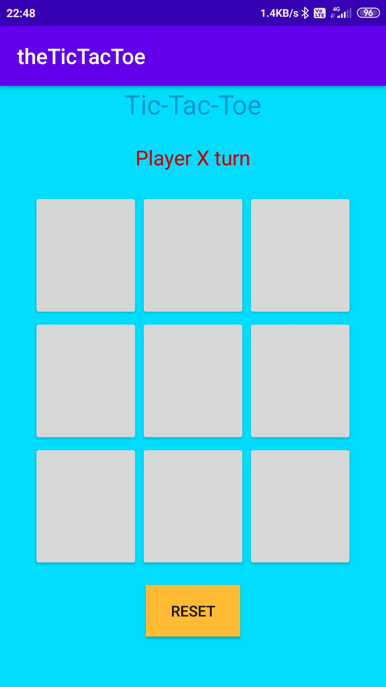
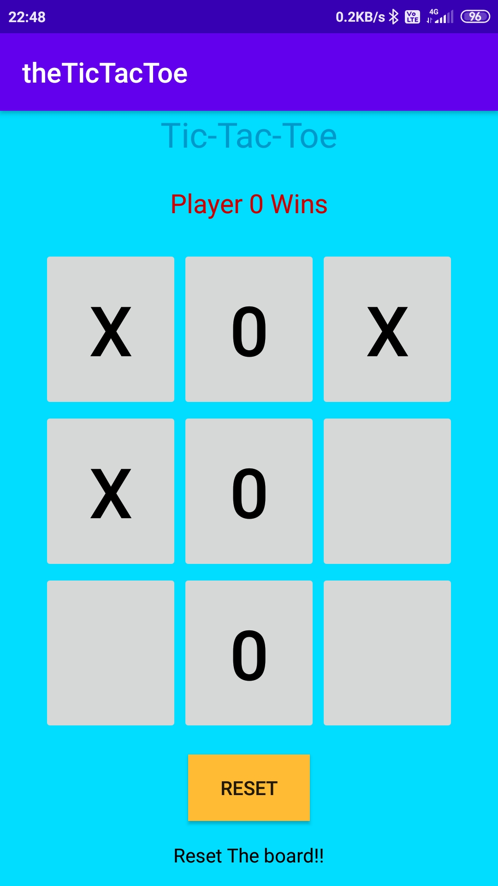
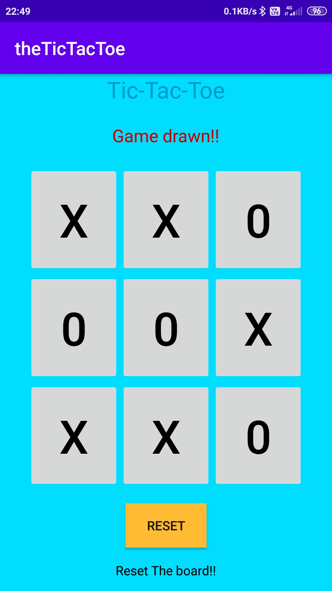

# Tic-Tac-Toe
This is the Tic tac Toe android Application. Created its layout using basic XML concepts and the backend working is written in Kotlin.

Here are some screenshots of the application – 

